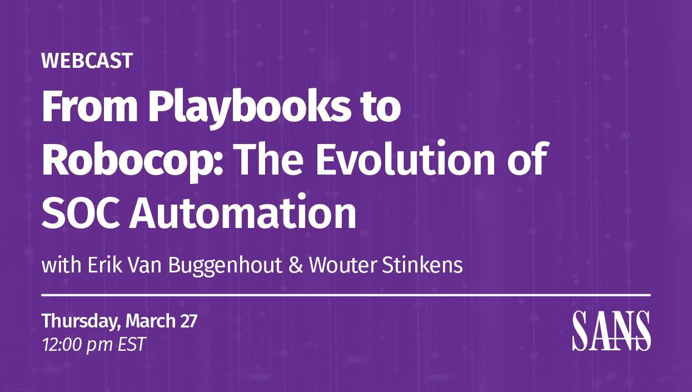

# Robocop: The Evolution of SOC Automation

This repository contains the demo code for the webcast organized by SANS titled [**"From Playbooks to Robocop: The Evolution of SOC Automation"**](https://www.sans.org/webcasts/from-playbooks-robocop-evolution-soc-automation/).



## Overview

The landscape of Security Operations is changing rapidly, and automation is leading the charge. In the second episode of the “Purple Team Power Hour”, we’ll explore how security teams are moving beyond static, pre-built playbooks toward dynamic, AI-driven solutions that can adapt to evolving threats in real time. 


## Prerequisites

- Azure OpenAI instance 

## Getting Started

1. Clone the repository:
    ```bash
    git clone git@github.com:NVISOsecurity/sans-webinar-robocop.git
    cd sans-webinar-robocop
    ```

2. Install dependencies:
    ```bash
    pip install -r requirements.txt
    ```

3. Copy .env file:
    ```bash
    cp .env_example .env
    ```

4. Set values in `.env` file

## Usage

Run the demo scripts to explore the automation examples:
```bash
python 01_agent.py
```

## License

This project is licensed under the [MIT License](LICENSE).
